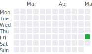

# Problem Solving Log

Daily problem-solving practice with clean, focused solutions and organized
references. Each day captures the challenge link, the implemented solution, and
sample input/output for quick validation.

## Structure

- dayX-<date>/
	- question.txt (problem URL or or full question explanation in text)
	- problem_name.cpp (solution [code])
	- input.txt / output.txt (sample I/O)

## Summary

<!-- SUMMARY:START -->
| 📝 Total Solved | 📅 Days Active | 🔥 Current Streak | ⚡ Longest Streak | 🏷️ Codeforces |
| :------------: | :-----------: | :---------------: | :---------------: | :-----------: |
| 1 | 1 | 1 days | 1 days | 1 |

<map name="activity-map">
  <area shape="rect" coords="28,18,39,29" title="February 09, 2026" alt="February 09, 2026">
  <area shape="rect" coords="28,31,39,42" title="February 10, 2026" alt="February 10, 2026">
  <area shape="rect" coords="28,44,39,55" title="February 11, 2026" alt="February 11, 2026">
  <area shape="rect" coords="28,57,39,68" title="February 12, 2026" alt="February 12, 2026">
  <area shape="rect" coords="28,70,39,81" title="February 13, 2026" alt="February 13, 2026">
  <area shape="rect" coords="28,83,39,94" title="February 14, 2026" alt="February 14, 2026">
  <area shape="rect" coords="28,96,39,107" title="February 15, 2026" alt="February 15, 2026">
  <area shape="rect" coords="41,18,52,29" title="February 16, 2026" alt="February 16, 2026">
  <area shape="rect" coords="41,31,52,42" title="February 17, 2026" alt="February 17, 2026">
  <area shape="rect" coords="41,44,52,55" title="February 18, 2026" alt="February 18, 2026">
  <area shape="rect" coords="41,57,52,68" title="February 19, 2026" alt="February 19, 2026">
  <area shape="rect" coords="41,70,52,81" title="February 20, 2026" alt="February 20, 2026">
  <area shape="rect" coords="41,83,52,94" title="February 21, 2026" alt="February 21, 2026">
  <area shape="rect" coords="41,96,52,107" title="February 22, 2026" alt="February 22, 2026">
  <area shape="rect" coords="54,18,65,29" title="February 23, 2026" alt="February 23, 2026">
  <area shape="rect" coords="54,31,65,42" title="February 24, 2026" alt="February 24, 2026">
  <area shape="rect" coords="54,44,65,55" title="February 25, 2026" alt="February 25, 2026">
  <area shape="rect" coords="54,57,65,68" title="February 26, 2026" alt="February 26, 2026">
  <area shape="rect" coords="54,70,65,81" title="February 27, 2026" alt="February 27, 2026">
  <area shape="rect" coords="54,83,65,94" title="February 28, 2026" alt="February 28, 2026">
  <area shape="rect" coords="54,96,65,107" title="March 01, 2026" alt="March 01, 2026">
  <area shape="rect" coords="67,18,78,29" title="March 02, 2026" alt="March 02, 2026">
  <area shape="rect" coords="67,31,78,42" title="March 03, 2026" alt="March 03, 2026">
  <area shape="rect" coords="67,44,78,55" title="March 04, 2026" alt="March 04, 2026">
  <area shape="rect" coords="67,57,78,68" title="March 05, 2026" alt="March 05, 2026">
  <area shape="rect" coords="67,70,78,81" title="March 06, 2026" alt="March 06, 2026">
  <area shape="rect" coords="67,83,78,94" title="March 07, 2026" alt="March 07, 2026">
  <area shape="rect" coords="67,96,78,107" title="March 08, 2026" alt="March 08, 2026">
  <area shape="rect" coords="80,18,91,29" title="March 09, 2026" alt="March 09, 2026">
  <area shape="rect" coords="80,31,91,42" title="March 10, 2026" alt="March 10, 2026">
  <area shape="rect" coords="80,44,91,55" title="March 11, 2026" alt="March 11, 2026">
  <area shape="rect" coords="80,57,91,68" title="March 12, 2026" alt="March 12, 2026">
  <area shape="rect" coords="80,70,91,81" title="March 13, 2026" alt="March 13, 2026">
  <area shape="rect" coords="80,83,91,94" title="March 14, 2026" alt="March 14, 2026">
  <area shape="rect" coords="80,96,91,107" title="March 15, 2026" alt="March 15, 2026">
  <area shape="rect" coords="93,18,104,29" title="March 16, 2026" alt="March 16, 2026">
  <area shape="rect" coords="93,31,104,42" title="March 17, 2026" alt="March 17, 2026">
  <area shape="rect" coords="93,44,104,55" title="March 18, 2026" alt="March 18, 2026">
  <area shape="rect" coords="93,57,104,68" title="March 19, 2026" alt="March 19, 2026">
  <area shape="rect" coords="93,70,104,81" title="March 20, 2026" alt="March 20, 2026">
  <area shape="rect" coords="93,83,104,94" title="March 21, 2026" alt="March 21, 2026">
  <area shape="rect" coords="93,96,104,107" title="March 22, 2026" alt="March 22, 2026">
  <area shape="rect" coords="106,18,117,29" title="March 23, 2026" alt="March 23, 2026">
  <area shape="rect" coords="106,31,117,42" title="March 24, 2026" alt="March 24, 2026">
  <area shape="rect" coords="106,44,117,55" title="March 25, 2026" alt="March 25, 2026">
  <area shape="rect" coords="106,57,117,68" title="March 26, 2026" alt="March 26, 2026">
  <area shape="rect" coords="106,70,117,81" title="March 27, 2026" alt="March 27, 2026">
  <area shape="rect" coords="106,83,117,94" title="March 28, 2026" alt="March 28, 2026">
  <area shape="rect" coords="106,96,117,107" title="March 29, 2026" alt="March 29, 2026">
  <area shape="rect" coords="119,18,130,29" title="March 30, 2026" alt="March 30, 2026">
  <area shape="rect" coords="119,31,130,42" title="March 31, 2026" alt="March 31, 2026">
  <area shape="rect" coords="119,44,130,55" title="April 01, 2026" alt="April 01, 2026">
  <area shape="rect" coords="119,57,130,68" title="April 02, 2026" alt="April 02, 2026">
  <area shape="rect" coords="119,70,130,81" title="April 03, 2026" alt="April 03, 2026">
  <area shape="rect" coords="119,83,130,94" title="April 04, 2026" alt="April 04, 2026">
  <area shape="rect" coords="119,96,130,107" title="April 05, 2026" alt="April 05, 2026">
  <area shape="rect" coords="132,18,143,29" title="April 06, 2026" alt="April 06, 2026">
  <area shape="rect" coords="132,31,143,42" title="April 07, 2026" alt="April 07, 2026">
  <area shape="rect" coords="132,44,143,55" title="April 08, 2026" alt="April 08, 2026">
  <area shape="rect" coords="132,57,143,68" title="April 09, 2026" alt="April 09, 2026">
  <area shape="rect" coords="132,70,143,81" title="April 10, 2026" alt="April 10, 2026">
  <area shape="rect" coords="132,83,143,94" title="April 11, 2026" alt="April 11, 2026">
  <area shape="rect" coords="132,96,143,107" title="April 12, 2026" alt="April 12, 2026">
  <area shape="rect" coords="145,18,156,29" title="April 13, 2026" alt="April 13, 2026">
  <area shape="rect" coords="145,31,156,42" title="April 14, 2026" alt="April 14, 2026">
  <area shape="rect" coords="145,44,156,55" title="April 15, 2026" alt="April 15, 2026">
  <area shape="rect" coords="145,57,156,68" title="April 16, 2026" alt="April 16, 2026">
  <area shape="rect" coords="145,70,156,81" title="April 17, 2026" alt="April 17, 2026">
  <area shape="rect" coords="145,83,156,94" title="April 18, 2026" alt="April 18, 2026">
  <area shape="rect" coords="145,96,156,107" title="April 19, 2026" alt="April 19, 2026">
  <area shape="rect" coords="158,18,169,29" title="April 20, 2026" alt="April 20, 2026">
  <area shape="rect" coords="158,31,169,42" title="April 21, 2026" alt="April 21, 2026">
  <area shape="rect" coords="158,44,169,55" title="April 22, 2026" alt="April 22, 2026">
  <area shape="rect" coords="158,57,169,68" title="April 23, 2026" alt="April 23, 2026">
  <area shape="rect" coords="158,70,169,81" title="April 24, 2026" alt="April 24, 2026">
  <area shape="rect" coords="158,83,169,94" title="April 25, 2026" alt="April 25, 2026">
  <area shape="rect" coords="158,96,169,107" title="April 26, 2026" alt="April 26, 2026">
  <area shape="rect" coords="171,18,182,29" title="April 27, 2026" alt="April 27, 2026">
  <area shape="rect" coords="171,31,182,42" title="April 28, 2026" alt="April 28, 2026">
  <area shape="rect" coords="171,44,182,55" title="April 29, 2026" alt="April 29, 2026">
  <area shape="rect" coords="171,57,182,68" title="April 30, 2026" alt="April 30, 2026">
  <area shape="rect" coords="171,70,182,81" title="May 01, 2026" alt="May 01, 2026">
  <area shape="rect" coords="171,83,182,94" title="May 02, 2026" alt="May 02, 2026">
</map>
<!-- SUMMARY:END -->

## Daily Log

<!-- DAILY-LOG:START -->
Last updated: 02 May 2026

| Day | Date | Problem | Solution | Input | Output |
| :-: | :--: | ------- | -------- | :---: | :----: |
| [Day 1](day1-01:05:2026/) | 01:05:2026 | [231A](https://codeforces.com/problemset/problem/231/A) | [231A.cpp](day1-01:05:2026/231A.cpp) | [input.txt](day1-01:05:2026/input.txt) | [output.txt](day1-01:05:2026/output.txt) |
<!-- DAILY-LOG:END -->

